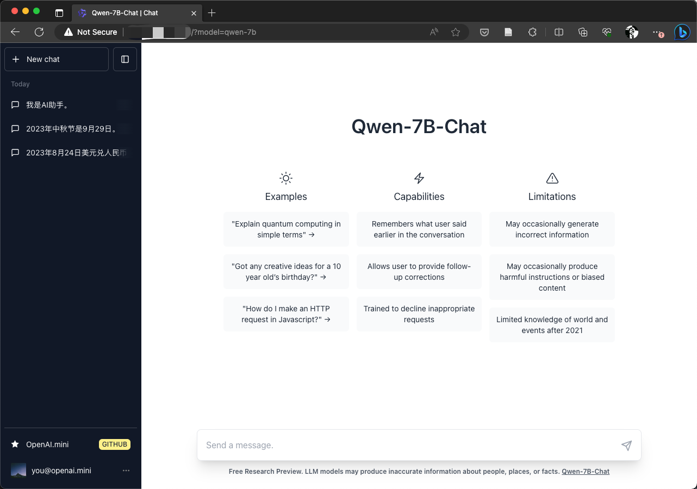
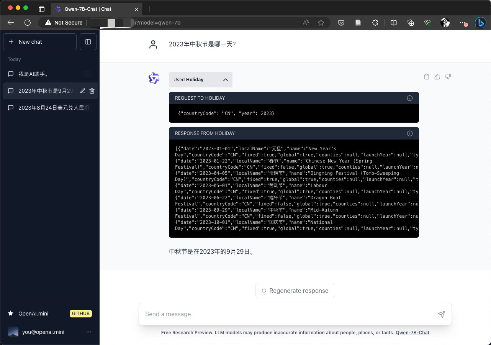

#  [WIP] OpenAI.mini

This repo implements OpenAI APIs with open source models, for example, open source LLMs for [chat](https://platform.openai.com/docs/api-reference/chat), `Whisper` for [audio](https://platform.openai.com/docs/api-reference/audio), `SDXL` for [image](https://platform.openai.com/docs/api-reference/images) and so on. With this repo, you can interact with LLMs using the [`openai` libraries](https://platform.openai.com/docs/api-reference) or the [`LangChain`](https://python.langchain.com/) library.


## Frontend
<div style="margin: 'auto'">
  
  
</div>

## How to use

### 1. Install dependencies
``` shell
pip3 install -r requirements.txt
pip3 install -r app/requirements.txt
```
If you have `make`, you can also run with
``` shell
make install
```

### 2. Get frontend
You may build the frontend with `yarn` yourself, or just download the built package from the release.
#### Option 1: install the dependencies and build frontend
```shell
cd app/frontend
yarn install
yarn build
```

#### Option 2: download it from release

1. Download the [`dist.tar.gz`](https://github.com/llmapp/openai.mini/releases/download/v0.0.2/dist.tar.gz) from release page.
2. Extract the `dist` directory and put it in the `app/frontend` directory

   Please make sure that the directory layout should be like this:
    ```shell
    ┌─hjmao in ~/workspace/openai.mini/app/frontend/dist
    └─± ls
    asset-manifest.json  assets  favicon.ico  index.html  manifest.json  robots.txt  static
    ```

### 3. Set the environment variables, and modify it.
``` shell
cp .env.example .env
# Modify the `.env` file
```

### 4. Download the model weight manually (Optional)
If you have already downloaded the weight files, or you want to manage the model weights in some place, you can specify a `MODEL_HUB_PATH` in the `.env` and put the weight files in it. `MODEL_HUB_PATH` is set to `hub` by default.
OpenAI.mini will first find the model weight in `MODEL_HUB_PATH`, if it does not exist in it, it will automatically download the weight files from Huggingface by the model name. The `MODEL_HUB_PATH` directory will be like this
<details>
  <summary>MODEL_HUB_PATH directory layout</summary>

``` shell
┌─hjmao at 573761 in ~/workspace/openai.mini/hub
└─○ tree -L 2
.
├── baichuan-inc
│   ├── Baichuan-13B-Base
│   ├── Baichuan-13B-Chat
│   └── Baichuan2-13B-Chat
├── intfloat
│   ├── e5-large-v2
│   └── multilingual-e5-large
├── meta-llama
│   ├── Llama-2-13b-chat-hf
│   └── Llama-2-7b-chat-hf
├── openai
│   ├── base.pt
│   ├── large-v2.pt
│   ├── medium.en.pt
│   ├── medium.pt
│   ├── small.pt
│   └── tiny.pt
├── Qwen
│   └── Qwen-7B-Chat
├── stabilityai
│   ├── FreeWilly2
│   ├── stable-diffusion-xl-base-0.9
│   └── stable-diffusion-xl-base-1.0
├── thenlper
│   └── gte-large
└── THUDM
    ├── chatglm2-6b
    ├── chatglm3-6b
    └── codegeex2-6b
```
</details>

Notice: the models can be loadded on startup or on the fly.

### 5. Start server with OpenAI.mini
``` shell
python3 -m src.api
python3 -m app.server
```

### 6. Access the OpenAI.mini services
OpenAI.mini have implemented most APIs of the OpenAI platform and also a ChatGPT-like web frontend.
You may access the OpenAI.mini services with the [openai libraries]() or chat with the models in the web frontend.
- Access as a openai service: You can use openai packages or the Langchain library to access it by setting the `openai.api_base="YOUR_OWN_IP:8000/api/v1"` and `openai.api_key="none_or_any_other_string". Find more detail [examples](https://github.com/huajianmao/openai.mini/tree/master#example-code) here.
- Access as a ChatGPT: You can open it with your web browser with `http://YOUR_OWN_IP:8001/index.html?model=MODEL_NAME`.


## OpenAI API Status

| Services          | API                      | Status           | Description             |
| :-----------------| :------------------------------------------------------------------------------------------------------| :----------------| :-----------------------|
| Authorization     |                                                                                                        |                  |                         |
| Models            | [List models](https://platform.openai.com/docs/api-reference/models/list)                              | ✅ Done          |                         |
| Models            | [Retrieve model](https://platform.openai.com/docs/api-reference/models/retrieve)                       | ✅ Done          |                         |
| Chat              | [Create chat completion](https://platform.openai.com/docs/api-reference/chat/create)                   | Partial Done     | Support Multi. LLMs     |
| Completions       | [Create completion](https://platform.openai.com/docs/api-reference/completions/create)                 |                  |                         |
| Images            | [Create image](https://platform.openai.com/docs/api-reference/images/create)                           | ✅ Done          |                         |
| Images            | [Create image edit](https://platform.openai.com/docs/api-reference/images/create-edit)                 |                  |                         |
| Images            | [Create image variation](https://platform.openai.com/docs/api-reference/images/create-variation)       |                  |                         |
| Embeddings        | [Create embeddings](https://platform.openai.com/docs/api-reference/embeddings/create)                  | ✅ Done          | Support Multi. LLMs     |
| Audio             | [Create transcription](https://platform.openai.com/docs/api-reference/audio/create-transcription)      | ✅ Done          |                         |
| Audio             | [Create translation](https://platform.openai.com/docs/api-reference/audio/create-translation)          | ✅ Done          |                         |
| Files             | [List files](https://platform.openai.com/docs/api-reference/files/list)                                | ✅ Done          |                         |
| Files             | [Upload file](https://platform.openai.com/docs/api-reference/files/upload)                             | ✅ Done          |                         |
| Files             | [Delete file](https://platform.openai.com/docs/api-reference/files/delete)                             | ✅ Done          |                         |
| Files             | [Retrieve file](https://platform.openai.com/docs/api-reference/files/retrieve)                         | ✅ Done          |                         |
| Files             | [Retrieve file content](https://platform.openai.com/docs/api-reference/files/retrieve-content)         | ✅ Done          |                         |
| Fine-tuning       | [Create fine-tuning job](https://platform.openai.com/docs/api-reference/fine-tuning/create)                   |                  |                         |
| Fine-tuning       | [Retrieve fine-tuning job](https://platform.openai.com/docs/api-reference/fine-tuning/retrieve)               |                  |                         |
| Fine-tuning       | [Cancel fine-tuning](https://platform.openai.com/docs/api-reference/fine-tuning/cancel)                   |                  |                         |
| Fine-tuning       | [List fine-tuning events](https://platform.openai.com/docs/api-reference/fine-tuning/list-events)              |                  |                         |                         |
| Moderations       | [Create moderation](https://platform.openai.com/docs/api-reference/moderations/create)                 |                  |                         |
| Edits             | [Create edit](https://platform.openai.com/docs/api-reference/edits/create)                             |                  |                         |

## Supported Language Models

| Model                                                                                 | #Params | Checkpoint link                                                                         |
| :------------------------------------------------------------------------------------ | :------ | :-------------------------------------------------------------------------------------- |
| [FreeWilly2](https://stability.ai/blog/freewilly-large-instruction-fine-tuned-models) | 70B     | [stabilityai/FreeWilly2](https://huggingface.co/stabilityai/FreeWilly2)                 |
| [Baichuan2-13B-Chat](https://github.com/baichuan-inc/Baichuan2-13B)                     | 13B     | [baichuan-inc/Baichuan2-13B-Chat](https://huggingface.co/baichuan-inc/Baichuan2-13B-Chat) |
| [Baichuan-13B-Chat](https://github.com/baichuan-inc/Baichuan-13B)                     | 13B     | [baichuan-inc/Baichuan-13B-Chat](https://huggingface.co/baichuan-inc/Baichuan-13B-Chat) |
| [Llama-2-13b-chat-hf](https://github.com/facebookresearch/llama)                      | 13B     | [meta-llama/Llama-2-13b-chat-hf](https://huggingface.co/meta-llama/Llama-2-13b-chat-hf) |
| [Llama-2-7b-chat-hf](https://github.com/facebookresearch/llama)                       | 7B      | [meta-llama/Llama-2-7b-chat-hf](https://huggingface.co/meta-llama/Llama-2-7b-chat-hf)   |
| [Qwen-7B-Chat](https://github.com/QwenLM/Qwen-7B) | 7B     | [Qwen/Qwen-7B-Chat](https://huggingface.co/Qwen/Qwen-7B-Chat)                 |
| [internlm-chat-7b](https://github.com/InternLM/InternLM)                              | 7B      | [internlm/internlm-chat-7b](https://huggingface.co/internlm/internlm-chat-7b)           |
| [chatglm3-6b](https://github.com/THUDM/ChatGLM3-6B)                                   | 6B      | [THUDM/chatglm3-6b](https://huggingface.co/THUDM/chatglm3-6b)                             |
| [chatglm2-6b](https://github.com/THUDM/ChatGLM2-6B)                                   | 6B      | [THUDM/chatglm2-6b](https://huggingface.co/THUDM/chatglm2-6b)                           |
| [chatglm-6b](https://github.com/THUDM/ChatGLM-6B)                                     | 6B      | [THUDM/chatglm-6b](https://huggingface.co/THUDM/chatglm-6b)                             |

## Supported Embedding Models

| Model                                                                                 | Embedding Dim.| Sequnce Length | Checkpoint link                                                                         |
| :------------------------------------------------------------------------------------ | :------ | :----- | :-------------------------------------------------------------------------------------- |
| [bge-large-zh](https://huggingface.co/BAAI/bge-large-zh) | 1024     | ? | [BAAI/bge-large-zh](https://huggingface.co/BAAI/bge-large-zh)                 |
| [m3e-large](https://huggingface.co/moka-ai/m3e-large) | 1024     | ? | [moka-ai/m3e-large](https://huggingface.co/moka-ai/m3e-large)                 |
| [text2vec-large-chinese](https://huggingface.co/GanymedeNil/text2vec-large-chinese) | 1024     | ? | [GanymedeNil/text2vec-large-chinese](https://huggingface.co/GanymedeNil/text2vec-large-chinese)                 |
| [gte-large](https://huggingface.co/thenlper/gte-large) | 1024     | 512 | [thenlper/gte-large](https://huggingface.co/thenlper/gte-large)                 |
| [e5-large-v2](https://huggingface.co/intfloat/e5-large-v2) | 1024     | 512 | [intfloat/e5-large-v2](https://huggingface.co/intfloat/e5-large-v2)                 |

## Supported Diffusion Modles

| Model                                                                             | #Resp Format  | Checkpoint link                                                                                             |
| :-------------------------------------------------------------------------------- | :------------ | :---------------------------------------------------------------------------------------------------------- |
| [stable-diffusion-xl-base-1.0](https://github.com/Stability-AI/generative-models) | b64_json, url | [stabilityai/stable-diffusion-xl-base-1.0](https://huggingface.co/stabilityai/stable-diffusion-xl-base-1.0) |
| [stable-diffusion-xl-base-0.9](https://github.com/Stability-AI/generative-models) | b64_json, url | [stabilityai/stable-diffusion-xl-base-0.9](https://huggingface.co/stabilityai/stable-diffusion-xl-base-0.9) |


## Supported Audio Models
| Model | #Params | Checkpoint link |
|:------|:--------|:---------------|
| [whisper-1](https://github.com/openai/whisper) | 1550 | alias for [whisper-large-v2](https://openaipublic.azureedge.net/main/whisper/models/81f7c96c852ee8fc832187b0132e569d6c3065a3252ed18e56effd0b6a73e524/large-v2.pt) |
| [whisper-large-v2](https://github.com/openai/whisper) | 1550 M | [large-v2](https://openaipublic.azureedge.net/main/whisper/models/81f7c96c852ee8fc832187b0132e569d6c3065a3252ed18e56effd0b6a73e524/large-v2.pt) |
| [whisper-medium](https://github.com/openai/whisper) | 769 M |  [medium](https://openaipublic.azureedge.net/main/whisper/models/345ae4da62f9b3d59415adc60127b97c714f32e89e936602e85993674d08dcb1/medium.pt) |
| [whisper-small](https://github.com/openai/whisper) | 244 M |  [small](https://openaipublic.azureedge.net/main/whisper/models/9ecf779972d90ba49c06d968637d720dd632c55bbf19d441fb42bf17a411e794/small.pt) |
| [whisper-base](https://github.com/openai/whisper) | 74 M | [base](https://openaipublic.azureedge.net/main/whisper/models/ed3a0b6b1c0edf879ad9b11b1af5a0e6ab5db9205f891f668f8b0e6c6326e34e/base.pt) |
| [whisper-tiny](https://github.com/openai/whisper) | 39 M | [tiny](https://openaipublic.azureedge.net/main/whisper/models/65147644a518d12f04e32d6f3b26facc3f8dd46e5390956a9424a650c0ce22b9/tiny.pt) |


## Example Code

### Stream Chat

```python
import openai

openai.api_base = "http://localhost:8000/api/v1"
openai.api_key = "none"

for chunk in openai.ChatCompletion.create(
    model="Baichuan2-13B-Chat",
    messages=[{"role": "user", "content": "Which moutain is the second highest one in the world?"}],
    stream=True
):
    if hasattr(chunk.choices[0].delta, "content"):
        print(chunk.choices[0].delta.content, end="", flush=True)
```

### Chat

```python
import openai

openai.api_base = "http://localhost:8000/api/v1"
openai.api_key = "none"

resp = openai.ChatCompletion.create(
    model="Baichuan2-13B-Chat",
    messages = [{ "role":"user", "content": "Which moutain is the second highest one in the world?" }]
)
print(resp.choices[0].message.content)
```

### Create Embeddings
```python
import openai

openai.api_base = "http://localhost:8000/api/v1"
openai.api_key = "none"

embeddings = openai.Embedding.create(
  model="gte-large",
  input="The food was delicious and the waiter..."
)

print(embeddings)
```

### List LLM Models

```python
import os
import openai

openai.api_base = "http://localhost:8000/api/v1"
openai.api_key = "none"

openai.Model.list()
```

### Create Image

```python
import os
import openai
from base64 import b64decode
from IPython.display import Image

openai.api_base = "http://localhost:8000/api/v1"
openai.api_key = "none"

response = openai.Image.create(
  prompt="An astronaut riding a green horse",
  n=1,
  size="1024x1024",
  response_format='b64_json'
)

b64_json = response['data'][0]['b64_json']
image = b64decode(b64_json)
Image(image)
```

### Create Transcription

```python
# Cell 1: set openai
import openai

openai.api_base = "http://localhost:8000/api/v1"
openai.api_key = "None"

# Cell 2: create a recorder in notebook
# ===================================================
# sudo apt install ffmpeg
# pip install torchaudio ipywebrtc notebook
# jupyter nbextension enable --py widgetsnbextension

from IPython.display import Audio
from ipywebrtc import AudioRecorder, CameraStream

camera = CameraStream(constraints={'audio': True,'video':False})
recorder = AudioRecorder(stream=camera)
recorder

# Cell 3: transcribe
import os
import openai

temp_file = '/tmp/recording.webm'
with open(temp_file, 'wb') as f:
    f.write(recorder.audio.value)
audio_file = open(temp_file, "rb")

transcript = openai.Audio.transcribe("whisper-1", audio_file)
print(transcript.text)
```

## Acknowledgement

项目参考了很多大佬的代码，例如 @xusenlinzy 大佬的[api-for-open-llm](https://github.com/xusenlinzy/api-for-open-llm/), @hiyouga 大佬的[LLaMA-Efficient-Tuning](https://github.com/hiyouga/LLaMA-Efficient-Tuning) 等，表示感谢。


## Star History

[](https://star-history.com/#llmapp/openai.mini)
